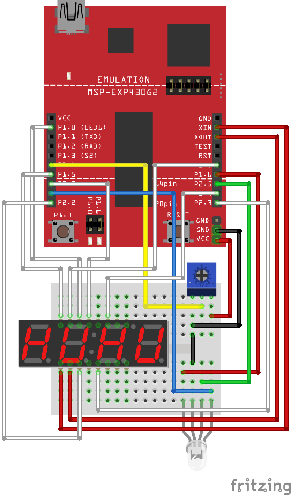

# Final Project: You've Got Teal!

### Functional Description

In an effort to better understand color, we will automatically generate the names of colors produced by our `RGB LED`.

[Editorial comment: in academia names are commonly a substitute for more fundamental experience and knowledge.]

Your project will allow a user to pick via the pushbutton one of red, green, or blue on the `RGB LED`, and then, using the `potentiometer`, dial in some degree of brightness. The combination of these three choices will effect a visual experience of color. The value of the current brightness should be displayed as two digits on your `7-segment display` (**N.B: we are using only two digits of it**).

But, since we need to have the psychological security of a name for that visual experience, your system will look up a predefined name from a table that has been painstakingly created. This table is laid out linearly as part of the code that is flashed (and thus is **read only!**) and you will access the appropriate char \* color name by using the 3 coordinates you have dialed in as above. You must do this by calculating an _offset_ into this list, in effect using it as a three-dimensional array. The list is ordered (red, green, blue) such that (0, 0, 0) is adjacent in memory to (1, 0, 0). If you wish to conceptualize conveniently you may consider it as an 8 x 8 x 8 organization of char \*. One corner (0, 0, 0) is _black_ and the extreme from it is (7, 7, 7) or _white_. Displaying the name will be done in real time using the libemb library that allows the display to occur on your host machine. Obviously we have more (r, g, b) coordinates defined on our display than we do in our name table. You must manage this mapping yourself.

### First Deliverable

Before you do any coding / wiring, you should first write a design document that describes both wiring and software _architecture_. This must be double spaced, Palatino, 12 point, .5 inch margins, staple in upper right corner at 45 degrees. It is clear that we are close to exhausting the pins we can use for the above functionality. You need to be quite specific about how the devices supporting the above functionality will be physically arranged.

As important, and related, is the organization of software modules, including a high level algorithm, and specific ISR and timer choices necessary to support the desired functionality.

You should also have a timeline of development -- with functional tests you will perform on the way to a complete system. You have already done a bit of this, but write the document and perform this work as though you were starting from scratch.

This document should be delivered by the Tuesday _after_ Thanksgiving, November 29. I cannot emphasize too much that the amount of detail (and thus thinking) in this document makes the progress to a working system smoother.

**PLEASE DO NOT CREATE THIS DOCUMENT AFTER THE FACT.**

### Final Deliverable

The final project will be demonstrated during the final exam, and a final report will be submitted that will include the design document with appropriate revisions reflecting any redesign or more detailed analysis.
